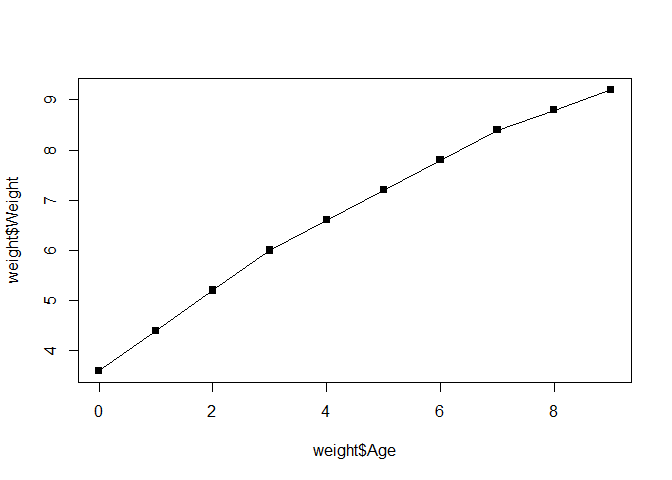
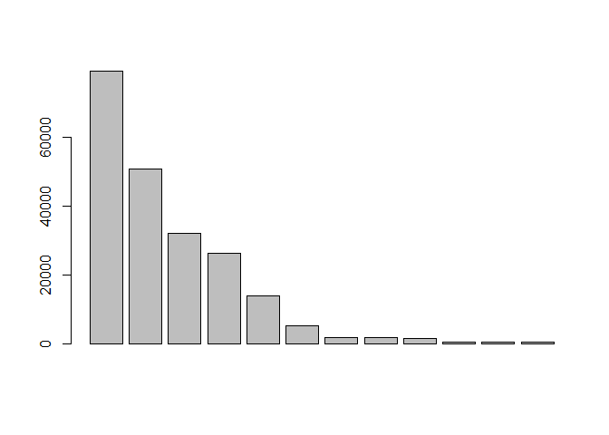
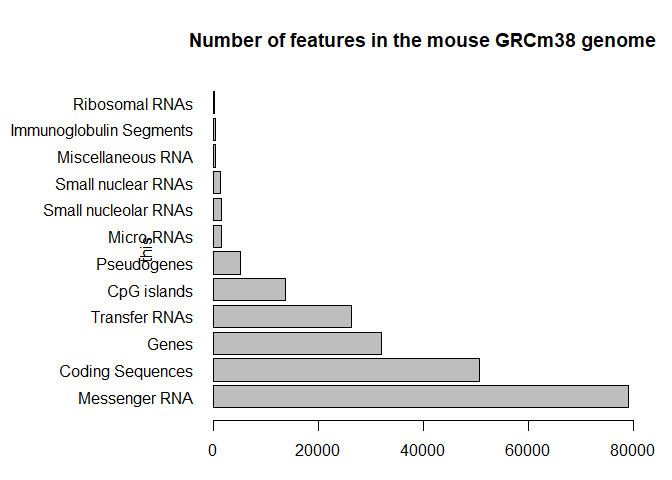

Data exploration and visualization in R
================

## GitHub Documents

This is an R Markdown format used for publishing markdown documents to
GitHub. When you click the **Knit** button all R code chunks are run and
a markdown file (.md) suitable for publishing to GitHub is generated.

``` r
##online worksheet stuff
weight <- read.table("bimm143_05_rstats/weight_chart.txt", header=TRUE)
View(weight)
plot(weight$Age, weight$Weight, typ="o", pch=15)
```

<!-- -->

``` r
mouse <- read.table("bimm143_05_rstats/feature_counts.txt", sep="\t", header=TRUE)
barplot(mouse$Count)
```

<!-- -->

``` r
par(mar=c(3.1, 11.1, 4.1, 2))
barplot(mouse$Count, names.arg=mouse$Feature, horiz=TRUE, ylab="this", main="Number of features in the mouse GRCm38 genome", las=1, xlim=c(0,80000))
```

<!-- -->

``` r
mf <- read.delim("bimm143_05_rstats/male_female_counts.txt")
```
