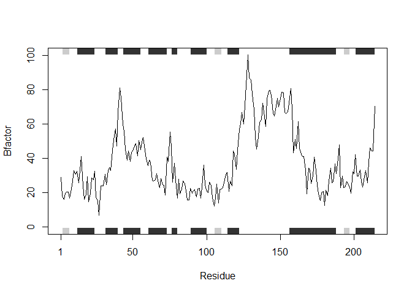
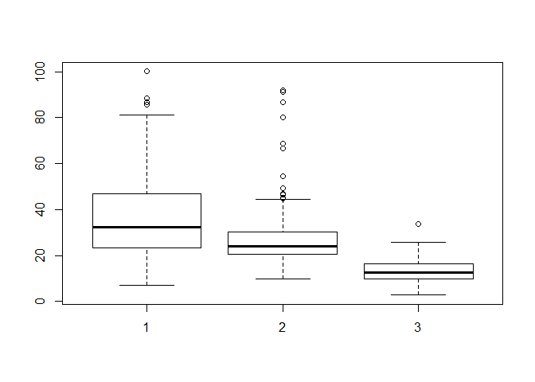
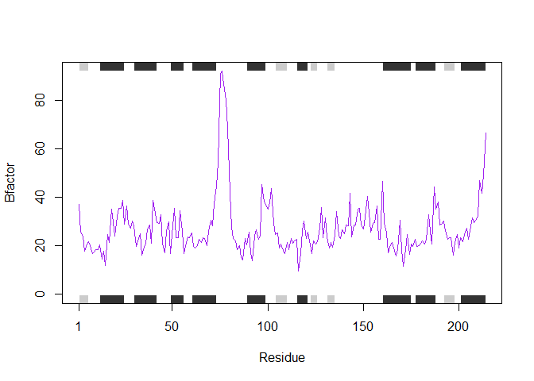
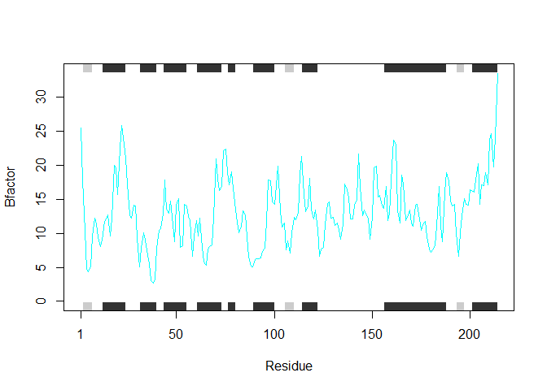
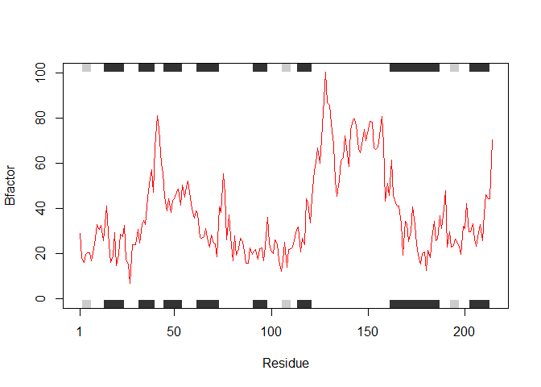
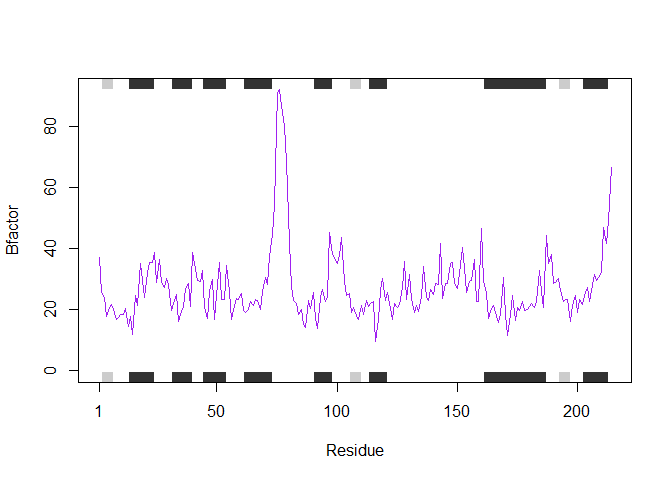

Class 6 hw
================

## GitHub Documents

This is an R Markdown format used for publishing markdown documents to
GitHub. When you click the **Knit** button all R code chunks are run and
a markdown file (.md) suitable for publishing to GitHub is generated.

## 

``` r
library(bio3d)
##read.pdb reads a Protein Data Bank (PDB) file
s1 <- read.pdb("4AKE") # kinase with drug
```

    ##   Note: Accessing on-line PDB file

``` r
##   Note: Accessing on-line PDB file
s2 <- read.pdb("1AKE") # kinase no drug
```

    ##   Note: Accessing on-line PDB file
    ##    PDB has ALT records, taking A only, rm.alt=TRUE

``` r
##   Note: Accessing on-line PDB file
##    PDB has ALT records, taking A only, rm.alt=TRUE
s3 <- read.pdb("1E4Y") # kinase with drug
```

    ##   Note: Accessing on-line PDB file

``` r
##   Note: Accessing on-line PDB file
##trim.pdb funciton trims to select s1 of chain A and elety refers to elements (maybe)
s1.chainA <- trim.pdb(s1, chain="A", elety="CA")
s2.chainA <- trim.pdb(s2, chain="A", elety="CA")
s3.chainA <- trim.pdb(s3, chain="A", elety="CA")
##specify for atom attribute
```

``` r
s1.b <- s1.chainA$atom$b
s2.b <- s2.chainA$atom$b
s3.b <- s3.chainA$atom$b
##to turn off the marginal black and grey rectangles you need to remove sum of squared errors (sse)
plotb3(s1.b, sse=s3.chainA, typ="l", ylab="Bfactor")
```

<!-- -->

``` r
##check similarity of proteins … which ones are more similar to each other
hc <- hclust( dist( rbind(s1.b, s2.b, s3.b) ) )
plot(hc)
```

<!-- -->

``` r
##distribution for each
boxplot(s1.b, s2.b, s3.b)
```

<!-- -->

``` r
#plots with different colors
plotb3(s1.b, sse=s1.chainA, typ="l", col="red", ylab="Bfactor")
```

<!-- -->

``` r
plotb3(s2.b, sse=s2.chainA, typ="l", col="purple", ylab="Bfactor")
```

<!-- -->

``` r
plotb3(s3.b, sse=s3.chainA, typ="l",col="cyan", ylab="Bfactor")
```

<!-- -->

``` r
##simplify
a <- s1.chainA
plotb3(s1.b, sse=a, typ="l", col="red", ylab="Bfactor")
```

<!-- -->

``` r
b <- s1.chainA
plotb3(s2.b, sse=b, typ="l", col="purple", ylab="Bfactor")
```

<!-- -->

``` r
c <- s3.chainA
plotb3(s3.b, sse=c, typ="l",col="cyan", ylab="Bfactor")
```

<!-- -->

\#\#question 6 hw

``` r
1/31/2020
```

    ## [1] 1.596934e-05

``` r
library(bio3d)
#rename the essentials
xmen <- "4AKE"

chaintype <- "A"

elements <- "CA"

this_plot <- function(xmen) {

#produce single element character vectors
  s <- read.pdb(xmen)

#trim pdb 
  s.chain <- trim.pdb(s, chain = chaintype, elety = elements)
  
#assign chain to have atom "b"
  s.elizabeth <- s.chain$atom$b
  
#plot
  plotb3(s.elizabeth, sse = s.chain, typ = "l", ylab = "Bfactor", main = (xmen))
}

this_plot(xmen)
```

    ##   Note: Accessing on-line PDB file

    ## Warning in get.pdb(file, path = tempdir(), verbose = FALSE): C:
    ## \Users\eliza\AppData\Local\Temp\Rtmpie3i5x/4AKE.pdb exists. Skipping download

<!-- -->
