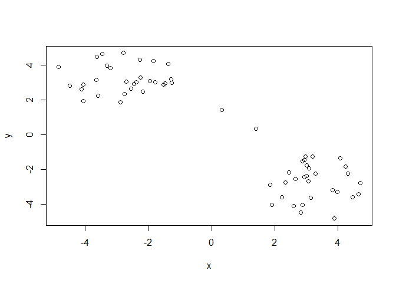
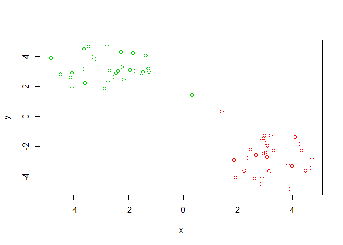
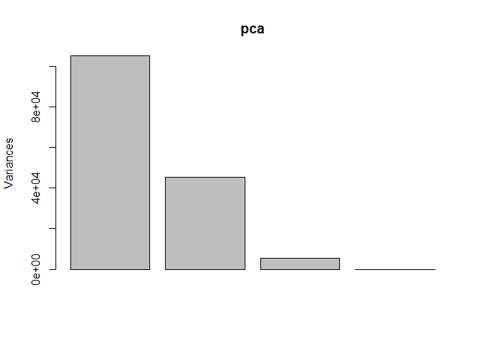

Class 9 updated
================

\#\#K-means clustering

Let’s try the kmeans() function in R to cluster some made-up example
data

\#tmp \#\#c puts things into a vector \#\#first call to R gives me 30
points with a mean of -3 (30 points clustered around -3) \#\#second call
to R gives me 30 points with a mean of 3 (30 points clustered around 3)

\#\#cbind binds data?? and will put x as first column, and y as a second
column \#\#rev means list the numbers in reverse

``` r
tmp <- c(rnorm(30,-3), rnorm(30,3))

x <- cbind(x=tmp, y=rev(tmp))

plot(x)
```

<!-- -->

\#KM is KMEANSs(x, CENTERS=2, NSTART=20)

``` r
km <- kmeans (x, centers =2, nstart=20)
```

``` r
print(km)
```

    ## K-means clustering with 2 clusters of sizes 30, 30
    ## 
    ## Cluster means:
    ##           x         y
    ## 1  2.748056 -3.262216
    ## 2 -3.262216  2.748056
    ## 
    ## Clustering vector:
    ##  [1] 2 2 2 2 2 2 2 2 2 2 2 2 2 2 2 2 2 2 2 2 2 2 2 2 2 2 2 2 2 2 1 1 1 1 1 1 1 1
    ## [39] 1 1 1 1 1 1 1 1 1 1 1 1 1 1 1 1 1 1 1 1 1 1
    ## 
    ## Within cluster sum of squares by cluster:
    ## [1] 54.63228 54.63228
    ##  (between_SS / total_SS =  90.8 %)
    ## 
    ## Available components:
    ## 
    ## [1] "cluster"      "centers"      "totss"        "withinss"     "tot.withinss"
    ## [6] "betweenss"    "size"         "iter"         "ifault"

\#\#clustering vectors - the different clusters (cluster 1 and cluster
2)

\#\#What is the output object ‘km’ ? \#\#Atributes function to find this
information use ‘attributes()’

``` r
attributes(km)
```

    ## $names
    ## [1] "cluster"      "centers"      "totss"        "withinss"     "tot.withinss"
    ## [6] "betweenss"    "size"         "iter"         "ifault"      
    ## 
    ## $class
    ## [1] "kmeans"

\#\#size gives you the number of points for vector 1 and 2

``` r
km$size
```

    ## [1] 30 30

\#cluster is a vector of integers indicating the cluster to which each
point is allocated

``` r
km$cluster
```

    ##  [1] 2 2 2 2 2 2 2 2 2 2 2 2 2 2 2 2 2 2 2 2 2 2 2 2 2 2 2 2 2 2 1 1 1 1 1 1 1 1
    ## [39] 1 1 1 1 1 1 1 1 1 1 1 1 1 1 1 1 1 1 1 1 1 1

\#\#let’s check how many 2s and 1s are in this vector with the cluster
function

``` r
table(km$cluster)
```

    ## 
    ##  1  2 
    ## 30 30

\#\#plot x colored by the kmenas cluster assignment and add cluster
centers as blue points

``` r
plot(x, col=km$cluster)
```

<!-- -->

``` r
c(rep("red", 30), rep("blue", 30))
```

    ##  [1] "red"  "red"  "red"  "red"  "red"  "red"  "red"  "red"  "red"  "red" 
    ## [11] "red"  "red"  "red"  "red"  "red"  "red"  "red"  "red"  "red"  "red" 
    ## [21] "red"  "red"  "red"  "red"  "red"  "red"  "red"  "red"  "red"  "red" 
    ## [31] "blue" "blue" "blue" "blue" "blue" "blue" "blue" "blue" "blue" "blue"
    ## [41] "blue" "blue" "blue" "blue" "blue" "blue" "blue" "blue" "blue" "blue"
    ## [51] "blue" "blue" "blue" "blue" "blue" "blue" "blue" "blue" "blue" "blue"

``` r
plot(x, col=km$cluster+1)
```

<!-- -->

``` r
plot(x, col=km$cluster+2)
```

<!-- -->

``` r
plot(x, col=km$cluster)
points(km$centers, col="blue")
```

<!-- -->

\#\#pch is for characters so you can get a big blue square

``` r
plot(x, col=km$cluster)
points(km$centers, col="blue", pch=15)
```

<!-- -->

\#can change shape of pch if you assign it a different number

``` r
plot(x, col=km$cluster)
points(km$centers, col="blue", pch=17)
```

<!-- -->

\#dist to calculate the distance \#\#HCLUST(DIST(X)) calcualting
distance matrix

\#the hclust() function is the main hierarchcal clustering method in R
and it **must** be passed a **distance matrix** as input not your raw
data\!

\#you can call seqeunce identities here, or structures

``` r
hc <- hclust(dist(x))
```

``` r
hc
```

    ## 
    ## Call:
    ## hclust(d = dist(x))
    ## 
    ## Cluster method   : complete 
    ## Distance         : euclidean 
    ## Number of objects: 60

``` r
plot(hc)
```

<!-- -->

\#\#1st vector contains points 1-30, 2nd vector contains points 31 - 60

\#cut below red line and get two branches

``` r
plot(hc)
abline(h=6, col="red")
```

<!-- -->

\#tell it a height of where to cut (cut by height **h**) \#lty to get a
dashed line

``` r
plot(hc)
abline(h=6, col="red", lty=2)
```

<!-- -->

``` r
cutree(hc, h=6)
```

    ##  [1] 1 1 1 1 1 1 1 1 1 1 1 1 1 1 1 1 1 1 1 1 1 1 1 1 1 1 1 1 1 1 2 2 2 2 2 2 2 2
    ## [39] 2 2 2 2 2 2 2 2 2 2 2 2 2 2 2 2 2 2 2 2 2 2

\#\#Now cut them into kgroups \#the higher the k gropu number, the
higher the number of groups you get

``` r
plot(hc)
abline(h=6, col="red", lty=2)
abline(h=6, col="blue", lty=2)
```

<!-- -->

``` r
cutree(hc, k=3.5) # Cut into k grps
```

    ##  [1] 1 1 1 1 1 1 1 1 1 1 1 1 1 1 1 1 1 1 1 1 1 1 1 1 1 1 1 1 1 1 2 3 2 3 2 2 2 2
    ## [39] 2 3 2 2 3 2 2 2 2 3 2 3 2 2 2 3 2 2 2 3 2 2

\#\#use a table to see how many points in each group

``` r
table(cutree(hc, h=3.5))
```

    ## 
    ##  1  2  3  4  5  6 
    ## 18  8  4 18  8  4

\#\#ask for k instead; you can also ask `cutree()` for the `k` number of
gorups that you want

``` r
cutree(hc, k=5)
```

    ##  [1] 1 1 2 1 1 1 2 1 1 1 2 1 2 1 1 1 1 2 1 1 2 1 1 1 1 1 2 1 2 1 3 4 5 4 3 5 3 3
    ## [39] 3 4 3 5 4 3 3 5 3 4 3 4 3 3 3 4 3 3 3 4 3 3

``` r
cutree(hc, k=3.5)
```

    ##  [1] 1 1 1 1 1 1 1 1 1 1 1 1 1 1 1 1 1 1 1 1 1 1 1 1 1 1 1 1 1 1 2 3 2 3 2 2 2 2
    ## [39] 2 3 2 2 3 2 2 2 2 3 2 3 2 2 2 3 2 2 2 3 2 2

\#\#Using different hierarchical clustering methods

\#\#hc.complete \<- hclust(d, method=“complete”) \#\#hc.average \<-
hclust(d, method=“average”) \#\#hc.single \<- hclust(d, method=“single”)

# Step 1. Generate some example data for clustering

``` r
x <- rbind(
matrix(rnorm(100, mean=0, sd=0.3), ncol = 2), # c1
matrix(rnorm(100, mean=1, sd=0.3), ncol = 2), # c2
matrix(c(rnorm(50, mean=1, sd=0.3), # c3
rnorm(50, mean=0, sd=0.3)), ncol = 2))
colnames(x) <- c("x", "y")
```

# Step 2. Plot the data without clustering

``` r
plot(x)
```

<!-- -->

# Step 3. Generate colors for known clusters

# (just so we can compare to hclust results)

``` r
col <- as.factor( rep(c("c1","c2","c3"), each=50) )
plot(x, col=col)
```

<!-- -->

\#Q. Use the dist(), hclust(), plot() and cutree() functions to return 2
and 3 clusters

\#membership factor (grps3)

\#Q. How does this compare to your known ‘col’ groups?

``` r
hc <- hclust(dist(x))
plot(hc)
```

<!-- -->

``` r
grps3 <- cutree(hc, k=3)
grps3
```

    ##   [1] 1 1 1 2 1 1 1 1 1 1 1 1 1 1 1 1 1 1 1 3 1 1 1 1 1 1 1 1 1 1 1 1 1 1 1 1 1
    ##  [38] 1 1 1 1 1 1 1 1 1 2 1 2 1 3 3 3 3 3 3 2 3 3 3 3 3 3 3 3 3 3 3 3 3 3 3 2 3
    ##  [75] 3 3 3 3 3 2 3 3 3 3 3 3 3 2 2 3 3 3 3 3 2 2 3 2 3 3 2 2 2 2 2 2 2 2 2 2 2
    ## [112] 2 2 2 2 2 1 2 2 2 2 3 2 2 2 2 2 2 2 2 2 3 2 2 2 2 2 2 2 2 2 2 2 2 2 2 2 2
    ## [149] 2 2

``` r
table(grps3)
```

    ## grps3
    ##  1  2  3 
    ## 47 58 45

\#color it by the membership (grps3) factor

``` r
plot(x, col=grps3)
```

<!-- -->

``` r
table(grps3)
```

    ## grps3
    ##  1  2  3 
    ## 47 58 45

\#\#set up a cross table

\#\#this will show you the points that were false-positives (the
smallest number in the table per c1, c2, or c3)

``` r
table(grps3, col)
```

    ##      col
    ## grps3 c1 c2 c3
    ##     1 46  0  1
    ##     2  3  8 47
    ##     3  1 42  2

\#**this should have given me a tale c1, c2, c3 rows and 1, 2, 3
columns**

\#Principal Component Analysis (PCA) the absolute basics \#when you have
a tone of cell lines \#*PCA converst correlation or lack there of a
represenation that you can actually look at* PCA shows us that those
that cluster together are similar

\#*the x-axis (PC1) are more important*

\#the main function in bas R for PCA is called prcomp(). Here we will
use PCA to examine the funny food that folks eat in the UK and N.
Ireland

``` r
x <- read.csv("UK_foods.csv")
```

## Preview the first 6 rows

``` r
rownames(x) <- x[,1]
x <- x[,-1]
head(x)
```

    ##                England Wales Scotland N.Ireland
    ## Cheese             105   103      103        66
    ## Carcass_meat       245   227      242       267
    ## Other_meat         685   803      750       586
    ## Fish               147   160      122        93
    ## Fats_and_oils      193   235      184       209
    ## Sugars             156   175      147       139

spotting major differences in trends

``` r
barplot(as.matrix(x), beside=T, col=rainbow(nrow(x)))
```

<!-- -->

``` r
pairs(x, col=rainbow(10), pch=16)
```

<!-- -->

# Use the prcomp() PCA function

\#\#t means transpose (from math)

``` r
pca <- prcomp(t(x))
```

\#gives the standard deviation \#looking at portion of variance. look at
most amount of variance

``` r
summary(pca)
```

    ## Importance of components:
    ##                             PC1      PC2      PC3       PC4
    ## Standard deviation     324.1502 212.7478 73.87622 4.189e-14
    ## Proportion of Variance   0.6744   0.2905  0.03503 0.000e+00
    ## Cumulative Proportion    0.6744   0.9650  1.00000 1.000e+00

\#\#second and third row from above are in percentages

\#look at the arributes

# Plot PC1 vs PC2

``` r
plot(pca$x[,], pca$x[,], xlab="PC1", ylab="PC2", xlim=c(-270,500))
text(pca$x[,1], pca$x[,2], colnames(x)) #this adds text for x and y coordinates and the country names
```

<!-- -->

\#Customize your plot so that the colors of the country names match the
colors in our UK and Ireland map and table at start of this document

\#adding colors: black for england b/c first on the table, wales in red,
scotland in blue, and ireland in dark green

``` r
plot(pca$x[,], pca$x[,], xlab="PC1", ylab="PC2", xlim=c(-270,500))
text(pca$x[,1], pca$x[,2], colnames(x), col=c("black", "red", "blue", "dark green")) 
```

<!-- -->

\#gives me a barplot

``` r
plot(pca)
```

<!-- -->

## Lets focus on PC1 as it accounts for \> 90% of variance

``` r
par(mar=c(10, 3, 0.35, 0))
barplot( pca$rotation[,1], las=2 )
```

<!-- -->

``` r
par(mar=c(10, 3, 0.35, 0))
barplot( pca$rotation[,2], las=2 )
```

<!-- -->

``` r
par(mar=c(10, 3, 0.35, 0))
barplot( pca$rotation[,3], las=2 )
```

<!-- -->

``` r
par(mar=c(10, 3, 0.35, 0))
barplot( pca$rotation[,1], las=1 )
```

<!-- -->

\#las gives you just one word and changes the y-axis

``` r
par(mar=c(10, 3, 0.35, 0))
barplot( pca$rotation[,1], las=3 )
```

<!-- -->

\#\#great
