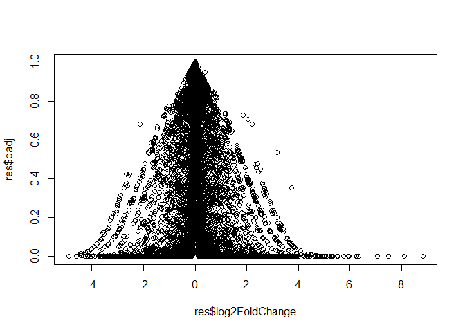
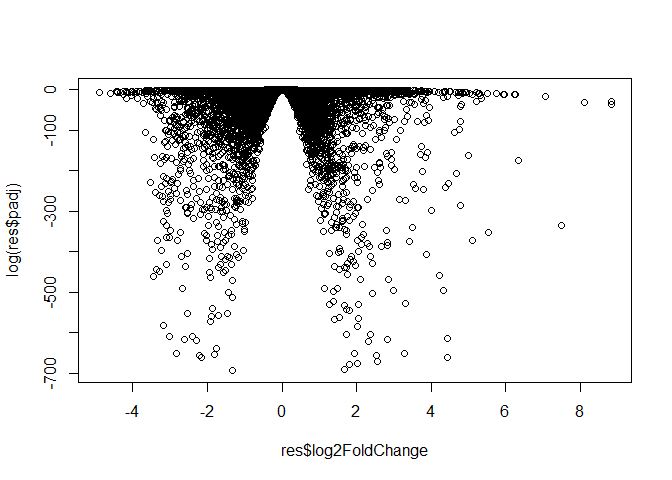

Class16 using DESeq2 for Differential Expression Analysis
================

## GitHub Documents

This is an R Markdown format used for publishing markdown documents to
GitHub. When you click the **Knit** button all R code chunks are run and
a markdown file (.md) suitable for publishing to GitHub is generated.

``` r
metaFile <- "GSE37704_metadata.csv"
countFile <- "GSE37704_featurecounts.csv"
```

## Import metadata and take a peak

\#\#Import countdata

\#\#the `colData` does not match with countData b/c first column in
`countData` is actually **length**

\#\#to find the number of rows and columns, respectively

``` r
dim(countData)
```

    ## [1] 19808     6

\#\#ust the TRUE FALSE to look up countData

\#\#call the rows that are not `0`

``` r
countData <- countData[rowSums(countData) != 0, ] ##this calls the rows that are NOT `0` but will call all the columns
```

\#\#how many genes do you have left? it says `15975`

``` r
dim(countData)
```

    ## [1] 15975     6

\#Run the DESeq2 \#\#Run DESeqDataSet object required for the `DESeq()`
function and then run the `DESeq` pipeline. This is again similar to our
last days hands-on session.

``` r
library(DESeq)
```

    ## Loading required package: BiocGenerics

    ## Loading required package: parallel

    ## 
    ## Attaching package: 'BiocGenerics'

    ## The following objects are masked from 'package:parallel':
    ## 
    ##     clusterApply, clusterApplyLB, clusterCall, clusterEvalQ,
    ##     clusterExport, clusterMap, parApply, parCapply, parLapply,
    ##     parLapplyLB, parRapply, parSapply, parSapplyLB

    ## The following objects are masked from 'package:stats':
    ## 
    ##     IQR, mad, sd, var, xtabs

    ## The following objects are masked from 'package:base':
    ## 
    ##     anyDuplicated, append, as.data.frame, basename, cbind, colnames,
    ##     dirname, do.call, duplicated, eval, evalq, Filter, Find, get, grep,
    ##     grepl, intersect, is.unsorted, lapply, Map, mapply, match, mget,
    ##     order, paste, pmax, pmax.int, pmin, pmin.int, Position, rank,
    ##     rbind, Reduce, rownames, sapply, setdiff, sort, table, tapply,
    ##     union, unique, unsplit, which, which.max, which.min

    ## Loading required package: Biobase

    ## Welcome to Bioconductor
    ## 
    ##     Vignettes contain introductory material; view with
    ##     'browseVignettes()'. To cite Bioconductor, see
    ##     'citation("Biobase")', and for packages 'citation("pkgname")'.

    ## Loading required package: locfit

    ## locfit 1.5-9.1    2013-03-22

    ## Loading required package: lattice

    ##     Welcome to 'DESeq'. For improved performance, usability and
    ##     functionality, please consider migrating to 'DESeq2'.

``` r
library(DESeq2)
```

    ## Loading required package: S4Vectors

    ## Loading required package: stats4

    ## 
    ## Attaching package: 'S4Vectors'

    ## The following object is masked from 'package:base':
    ## 
    ##     expand.grid

    ## Loading required package: IRanges

    ## 
    ## Attaching package: 'IRanges'

    ## The following object is masked from 'package:grDevices':
    ## 
    ##     windows

    ## Loading required package: GenomicRanges

    ## Loading required package: GenomeInfoDb

    ## Loading required package: SummarizedExperiment

    ## Loading required package: DelayedArray

    ## Loading required package: matrixStats

    ## 
    ## Attaching package: 'matrixStats'

    ## The following objects are masked from 'package:Biobase':
    ## 
    ##     anyMissing, rowMedians

    ## Loading required package: BiocParallel

    ## 
    ## Attaching package: 'DelayedArray'

    ## The following objects are masked from 'package:matrixStats':
    ## 
    ##     colMaxs, colMins, colRanges, rowMaxs, rowMins, rowRanges

    ## The following objects are masked from 'package:base':
    ## 
    ##     aperm, apply, rowsum

    ## 
    ## Attaching package: 'DESeq2'

    ## The following objects are masked from 'package:DESeq':
    ## 
    ##     estimateSizeFactorsForMatrix, getVarianceStabilizedData,
    ##     varianceStabilizingTransformation

``` r
library(BiocVersion)
```

``` r
dds = DESeqDataSetFromMatrix(countData = countData, colData = colData, design =~ condition)
```

``` r
dds = DESeq(dds)
```

    ## estimating size factors

    ## estimating dispersions

    ## gene-wise dispersion estimates

    ## mean-dispersion relationship

    ## final dispersion estimates

    ## fitting model and testing

``` r
dds
```

    ## class: DESeqDataSet 
    ## dim: 15975 6 
    ## metadata(1): version
    ## assays(4): counts mu H cooks
    ## rownames(15975): ENSG00000279457 ENSG00000187634 ... ENSG00000276345
    ##   ENSG00000271254
    ## rowData names(22): baseMean baseVar ... deviance maxCooks
    ## colnames(6): SRR493366 SRR493367 ... SRR493370 SRR493371
    ## colData names(2): condition sizeFactor

\#\#Next, get results for the HoxA1 knockdown versus control siRNA
(remember that these were labeled as “hoxa1\_kd” and “control\_sirna” in
our original colData metaFile input to DESeq, you can check this above
and by running resultsNames(dds) command).

``` r
res = results(dds)
```

``` r
summary(res)
```

    ## 
    ## out of 15975 with nonzero total read count
    ## adjusted p-value < 0.1
    ## LFC > 0 (up)       : 4349, 27%
    ## LFC < 0 (down)     : 4396, 28%
    ## outliers [1]       : 0, 0%
    ## low counts [2]     : 1237, 7.7%
    ## (mean count < 0)
    ## [1] see 'cooksCutoff' argument of ?results
    ## [2] see 'independentFiltering' argument of ?results

\#\#need `log2Foldchage` and `padj` columns to plot volcano plot

``` r
plot(res$log2FoldChange, res$padj) ##will give you all the data you want squished at the bottom
```

<!-- -->

``` r
plot(res$log2FoldChange, log(res$padj)) ##all the bottom data point are significant but this is upside down
```

<!-- -->

``` r
plot(res$log2FoldChange, -log(res$padj)) ##add a negative number in front of `log` to get it right-side up
```

<!-- -->

\#\#Make a color vector for all genes

``` r
mycols <- rep("gray", nrow(res) )
```

``` r
# Color red the genes with absolute fold change above 2
mycols[ abs(res$log2FoldChange) > 2 ] <- "red"
```

# Color blue those with adjusted p-value `res$padj` less than 0.01

# and absolute fold change more than 2. `abs` will color both sides not just the `positive` values

``` r
inds <- (res$padj < 0.01) & (abs(res$log2FoldChange) > 2 )
mycols[ inds ] <- "blue"
```

\#\#the cols is the `mycols` from above

``` r
plot( res$log2FoldChange, -log(res$padj), col=mycols, xlab="Log2(FoldChange)", ylab="-Log(P-value)" )
```

<!-- -->

``` r
library("AnnotationDbi")
```

``` r
library("org.Hs.eg.db")
```

    ## 

``` r
columns(org.Hs.eg.db)
```

    ##  [1] "ACCNUM"       "ALIAS"        "ENSEMBL"      "ENSEMBLPROT"  "ENSEMBLTRANS"
    ##  [6] "ENTREZID"     "ENZYME"       "EVIDENCE"     "EVIDENCEALL"  "GENENAME"    
    ## [11] "GO"           "GOALL"        "IPI"          "MAP"          "OMIM"        
    ## [16] "ONTOLOGY"     "ONTOLOGYALL"  "PATH"         "PFAM"         "PMID"        
    ## [21] "PROSITE"      "REFSEQ"       "SYMBOL"       "UCSCKG"       "UNIGENE"     
    ## [26] "UNIPROT"

\#\#need to tell `mapIds` name, format, what format we want. Let’s map
our ENSEMBLE gene I`Ids` to the conventional `symbol`

``` r
res$symbol = mapIds(org.Hs.eg.db,
      keys= rownames(res),
      keytype="ENSEMBL",
      column= "SYMBOL",
      multiVals="first")
```

    ## 'select()' returned 1:many mapping between keys and columns

``` r
head(res)
```

    ## log2 fold change (MLE): condition hoxa1 kd vs control sirna 
    ## Wald test p-value: condition hoxa1 kd vs control sirna 
    ## DataFrame with 6 rows and 7 columns
    ##                         baseMean     log2FoldChange              lfcSE
    ##                        <numeric>          <numeric>          <numeric>
    ## ENSG00000279457 29.9135794276176   0.17925708367269  0.324821565250145
    ## ENSG00000187634 183.229649921658  0.426457118403306  0.140265820376892
    ## ENSG00000188976 1651.18807619944 -0.692720464846366 0.0548465415913946
    ## ENSG00000187961 209.637938486147  0.729755610585225  0.131859899969345
    ## ENSG00000187583 47.2551232589398 0.0405765278756312  0.271892808601774
    ## ENSG00000187642 11.9797501642461  0.542810491577363  0.521559849534146
    ##                              stat               pvalue                 padj
    ##                         <numeric>            <numeric>            <numeric>
    ## ENSG00000279457 0.551863246932648    0.581042050747032      0.6865547778329
    ## ENSG00000187634  3.04034951107421  0.00236303749730996  0.00515718149494361
    ## ENSG00000188976 -12.6301576133481 1.43989540156582e-36  1.7654890539332e-35
    ## ENSG00000187961  5.53432552849563  3.1242824807768e-08 1.13412993107607e-07
    ## ENSG00000187583 0.149237223611387    0.881366448669148    0.919030615571381
    ## ENSG00000187642  1.04074439790984    0.297994191720983    0.403379309754068
    ##                      symbol
    ##                 <character>
    ## ENSG00000279457          NA
    ## ENSG00000187634      SAMD11
    ## ENSG00000188976       NOC2L
    ## ENSG00000187961      KLHL17
    ## ENSG00000187583     PLEKHN1
    ## ENSG00000187642       PERM1

``` r
res$symbol = mapIds(org.Hs.eg.db,
      keys= row.names(res),
      keytype="ENSEMBL",
      column= "SYMBOL",
      multiVals="first")
```

    ## 'select()' returned 1:many mapping between keys and columns

``` r
res$entrez = mapIds(org.Hs.eg.db,
                    keys=row.names(res),
                    keytype="ENSEMBL",
                    column="ENTREZID",
                    multiVals="first")
```

    ## 'select()' returned 1:many mapping between keys and columns

``` r
res$name =   mapIds(org.Hs.eg.db,
                    keys=row.names(res),
                    keytype="ENSEMBL",
                    column="GENENAME",
                    multiVals="first")
```

    ## 'select()' returned 1:many mapping between keys and columns

``` r
head(res, 10)
```

    ## log2 fold change (MLE): condition hoxa1 kd vs control sirna 
    ## Wald test p-value: condition hoxa1 kd vs control sirna 
    ## DataFrame with 10 rows and 9 columns
    ##                          baseMean     log2FoldChange              lfcSE
    ##                         <numeric>          <numeric>          <numeric>
    ## ENSG00000279457  29.9135794276176   0.17925708367269  0.324821565250145
    ## ENSG00000187634  183.229649921658  0.426457118403306  0.140265820376892
    ## ENSG00000188976  1651.18807619944 -0.692720464846366 0.0548465415913946
    ## ENSG00000187961  209.637938486147  0.729755610585225  0.131859899969345
    ## ENSG00000187583  47.2551232589398 0.0405765278756312  0.271892808601774
    ## ENSG00000187642  11.9797501642461  0.542810491577363  0.521559849534146
    ## ENSG00000188290  108.922127976716    2.0570638345631  0.196905312993839
    ## ENSG00000187608   350.71686801731  0.257383686481771  0.102726560033541
    ## ENSG00000188157    9128.439421961  0.389908792022773 0.0467163395511376
    ## ENSG00000237330 0.158192358990472  0.785955208142751    4.0804728567969
    ##                              stat               pvalue                 padj
    ##                         <numeric>            <numeric>            <numeric>
    ## ENSG00000279457 0.551863246932648    0.581042050747032      0.6865547778329
    ## ENSG00000187634  3.04034951107421  0.00236303749730996  0.00515718149494361
    ## ENSG00000188976 -12.6301576133481 1.43989540156582e-36  1.7654890539332e-35
    ## ENSG00000187961  5.53432552849563  3.1242824807768e-08 1.13412993107607e-07
    ## ENSG00000187583 0.149237223611387    0.881366448669148    0.919030615571381
    ## ENSG00000187642  1.04074439790984    0.297994191720983    0.403379309754068
    ## ENSG00000188290  10.4469696794188 1.51281875407629e-25  1.3053818968136e-24
    ## ENSG00000187608  2.50552229528308   0.0122270689409846   0.0237452288907934
    ## ENSG00000188157  8.34630443585938 7.04321148758242e-17 4.21962808552804e-16
    ## ENSG00000237330 0.192613757210411    0.847261469988086                   NA
    ##                      symbol      entrez
    ##                 <character> <character>
    ## ENSG00000279457          NA          NA
    ## ENSG00000187634      SAMD11      148398
    ## ENSG00000188976       NOC2L       26155
    ## ENSG00000187961      KLHL17      339451
    ## ENSG00000187583     PLEKHN1       84069
    ## ENSG00000187642       PERM1       84808
    ## ENSG00000188290        HES4       57801
    ## ENSG00000187608       ISG15        9636
    ## ENSG00000188157        AGRN      375790
    ## ENSG00000237330      RNF223      401934
    ##                                                                     name
    ##                                                              <character>
    ## ENSG00000279457                                                       NA
    ## ENSG00000187634                 sterile alpha motif domain containing 11
    ## ENSG00000188976 NOC2 like nucleolar associated transcriptional repressor
    ## ENSG00000187961                              kelch like family member 17
    ## ENSG00000187583                 pleckstrin homology domain containing N1
    ## ENSG00000187642             PPARGC1 and ESRR induced regulator, muscle 1
    ## ENSG00000188290                   hes family bHLH transcription factor 4
    ## ENSG00000187608                            ISG15 ubiquitin like modifier
    ## ENSG00000188157                                                    agrin
    ## ENSG00000237330                                  ring finger protein 223

\#\#SAve our quantitative results

``` r
res = res[order(res$pvalue),]
write.csv(res, file="deseq_results.csv")
```

\#\#section 2 using KEGG pathwasy and GO

``` r
library(pathview)
```

    ## ##############################################################################
    ## Pathview is an open source software package distributed under GNU General
    ## Public License version 3 (GPLv3). Details of GPLv3 is available at
    ## http://www.gnu.org/licenses/gpl-3.0.html. Particullary, users are required to
    ## formally cite the original Pathview paper (not just mention it) in publications
    ## or products. For details, do citation("pathview") within R.
    ## 
    ## The pathview downloads and uses KEGG data. Non-academic uses may require a KEGG
    ## license agreement (details at http://www.kegg.jp/kegg/legal.html).
    ## ##############################################################################

``` r
library(gage)
library(gageData)
```

``` r
data(kegg.sets.hs)
data(sigmet.idx.hs)
```

# Focus on signaling and metabolic pathways only

``` r
kegg.sets.hs = kegg.sets.hs[sigmet.idx.hs]
```

# Examine the first 3 pathways

``` r
head(kegg.sets.hs, 3)
```

    ## $`hsa00232 Caffeine metabolism`
    ## [1] "10"   "1544" "1548" "1549" "1553" "7498" "9"   
    ## 
    ## $`hsa00983 Drug metabolism - other enzymes`
    ##  [1] "10"     "1066"   "10720"  "10941"  "151531" "1548"   "1549"   "1551"  
    ##  [9] "1553"   "1576"   "1577"   "1806"   "1807"   "1890"   "221223" "2990"  
    ## [17] "3251"   "3614"   "3615"   "3704"   "51733"  "54490"  "54575"  "54576" 
    ## [25] "54577"  "54578"  "54579"  "54600"  "54657"  "54658"  "54659"  "54963" 
    ## [33] "574537" "64816"  "7083"   "7084"   "7172"   "7363"   "7364"   "7365"  
    ## [41] "7366"   "7367"   "7371"   "7372"   "7378"   "7498"   "79799"  "83549" 
    ## [49] "8824"   "8833"   "9"      "978"   
    ## 
    ## $`hsa00230 Purine metabolism`
    ##   [1] "100"    "10201"  "10606"  "10621"  "10622"  "10623"  "107"    "10714" 
    ##   [9] "108"    "10846"  "109"    "111"    "11128"  "11164"  "112"    "113"   
    ##  [17] "114"    "115"    "122481" "122622" "124583" "132"    "158"    "159"   
    ##  [25] "1633"   "171568" "1716"   "196883" "203"    "204"    "205"    "221823"
    ##  [33] "2272"   "22978"  "23649"  "246721" "25885"  "2618"   "26289"  "270"   
    ##  [41] "271"    "27115"  "272"    "2766"   "2977"   "2982"   "2983"   "2984"  
    ##  [49] "2986"   "2987"   "29922"  "3000"   "30833"  "30834"  "318"    "3251"  
    ##  [57] "353"    "3614"   "3615"   "3704"   "377841" "471"    "4830"   "4831"  
    ##  [65] "4832"   "4833"   "4860"   "4881"   "4882"   "4907"   "50484"  "50940" 
    ##  [73] "51082"  "51251"  "51292"  "5136"   "5137"   "5138"   "5139"   "5140"  
    ##  [81] "5141"   "5142"   "5143"   "5144"   "5145"   "5146"   "5147"   "5148"  
    ##  [89] "5149"   "5150"   "5151"   "5152"   "5153"   "5158"   "5167"   "5169"  
    ##  [97] "51728"  "5198"   "5236"   "5313"   "5315"   "53343"  "54107"  "5422"  
    ## [105] "5424"   "5425"   "5426"   "5427"   "5430"   "5431"   "5432"   "5433"  
    ## [113] "5434"   "5435"   "5436"   "5437"   "5438"   "5439"   "5440"   "5441"  
    ## [121] "5471"   "548644" "55276"  "5557"   "5558"   "55703"  "55811"  "55821" 
    ## [129] "5631"   "5634"   "56655"  "56953"  "56985"  "57804"  "58497"  "6240"  
    ## [137] "6241"   "64425"  "646625" "654364" "661"    "7498"   "8382"   "84172" 
    ## [145] "84265"  "84284"  "84618"  "8622"   "8654"   "87178"  "8833"   "9060"  
    ## [153] "9061"   "93034"  "953"    "9533"   "954"    "955"    "956"    "957"   
    ## [161] "9583"   "9615"

\#\#The main `gage()` function requires a named vector of fold changes,
where the names of the values are the Entrez gene IDs.

\#\#Note that we used the `mapIDs()` function above to obtain Entrez
gene IDs (stored in
**res\(entrez**) and we have the fold change results from DESeq2 analysis (stored in **res\)log2FoldChange**)

\#our input will be a vector of fold change (whatever number you care
about in your experiment) with the gene Ids as names

``` r
foldchanges = res$log2FoldChange
names(foldchanges) = res$entrez
head(foldchanges)
```

    ##      1266     54855      1465     51232      2034      2317 
    ## -2.422719  3.201955 -2.313738 -2.059631 -1.888019 -1.649792

\#Now, let’s run the gage pathway analysis.Get the results

``` r
keggres = gage(foldchanges, gsets=kegg.sets.hs)
```

``` r
attributes(keggres)
```

    ## $names
    ## [1] "greater" "less"    "stats"

\#\#look at the pathway id of the first hit `cell cycle`

``` r
pathview(gene.data=foldchanges, pathway.id="hsa04110")
```

    ## 'select()' returned 1:1 mapping between keys and columns

    ## Info: Working in directory C:/Users/eliza/Desktop/BGGN 213/class10 and onward/class10/bggn213_github/Class16/class16

    ## Info: Writing image file hsa04110.pathview.png

# A different PDF based output of the same data

``` r
pathview(gene.data=foldchanges, pathway.id="hsa04110", kegg.native=FALSE)
```

    ## 'select()' returned 1:1 mapping between keys and columns

    ## Info: Working in directory C:/Users/eliza/Desktop/BGGN 213/class10 and onward/class10/bggn213_github/Class16/class16

    ## Info: Writing image file hsa04110.pathview.pdf

## Focus on top 5 upregulated pathways here for demo purposes only

``` r
keggrespathways <- rownames(keggres$greater)[1:5]

# Extract the 8 character long IDs part of each string
keggresids = substr(keggrespathways, start=1, stop=8)
keggresids
```

    ## [1] "hsa04640" "hsa04630" "hsa00140" "hsa04142" "hsa04330"

\#this is importnat piced of code to view graph and it saves it to your
`files` automatically on your right

``` r
pathview(gene.data=foldchanges, pathway.id=keggresids, species="hsa")
```

    ## 'select()' returned 1:1 mapping between keys and columns

    ## Info: Working in directory C:/Users/eliza/Desktop/BGGN 213/class10 and onward/class10/bggn213_github/Class16/class16

    ## Info: Writing image file hsa04640.pathview.png

    ## 'select()' returned 1:1 mapping between keys and columns

    ## Info: Working in directory C:/Users/eliza/Desktop/BGGN 213/class10 and onward/class10/bggn213_github/Class16/class16

    ## Info: Writing image file hsa04630.pathview.png

    ## 'select()' returned 1:1 mapping between keys and columns

    ## Info: Working in directory C:/Users/eliza/Desktop/BGGN 213/class10 and onward/class10/bggn213_github/Class16/class16

    ## Info: Writing image file hsa00140.pathview.png

    ## 'select()' returned 1:1 mapping between keys and columns

    ## Info: Working in directory C:/Users/eliza/Desktop/BGGN 213/class10 and onward/class10/bggn213_github/Class16/class16

    ## Info: Writing image file hsa04142.pathview.png

    ## Info: some node width is different from others, and hence adjusted!

    ## 'select()' returned 1:1 mapping between keys and columns

    ## Info: Working in directory C:/Users/eliza/Desktop/BGGN 213/class10 and onward/class10/bggn213_github/Class16/class16

    ## Info: Writing image file hsa04330.pathview.png

``` r
knitr::include_graphics("hsa04110.pathview.png")
```


``` r
knitr::include_graphics("hsa04640.pathview.png")
```


``` r
knitr::include_graphics("hsa04630.pathview.png")
```


``` r
knitr::include_graphics("hsa00140.pathview.png")
```


``` r
knitr::include_graphics("hsa04142.pathview.png")
```


``` r
knitr::include_graphics("hsa04330.pathview.png")
```


\#part 3 Gene Ontology

``` r
data(go.sets.hs)
data(go.subs.hs)

# Focus on Biological Process subset of GO
gobpsets = go.sets.hs[go.subs.hs$BP]

gobpres = gage(foldchanges, gsets=gobpsets, same.dir=TRUE)

lapply(gobpres, head)
```

    ## $greater
    ##                                              p.geomean stat.mean        p.val
    ## GO:0007156 homophilic cell adhesion       8.519724e-05  3.824205 8.519724e-05
    ## GO:0002009 morphogenesis of an epithelium 1.396681e-04  3.653886 1.396681e-04
    ## GO:0048729 tissue morphogenesis           1.432451e-04  3.643242 1.432451e-04
    ## GO:0007610 behavior                       2.195494e-04  3.530241 2.195494e-04
    ## GO:0060562 epithelial tube morphogenesis  5.932837e-04  3.261376 5.932837e-04
    ## GO:0035295 tube development               5.953254e-04  3.253665 5.953254e-04
    ##                                               q.val set.size         exp1
    ## GO:0007156 homophilic cell adhesion       0.1952430      113 8.519724e-05
    ## GO:0002009 morphogenesis of an epithelium 0.1952430      339 1.396681e-04
    ## GO:0048729 tissue morphogenesis           0.1952430      424 1.432451e-04
    ## GO:0007610 behavior                       0.2244344      427 2.195494e-04
    ## GO:0060562 epithelial tube morphogenesis  0.3712298      257 5.932837e-04
    ## GO:0035295 tube development               0.3712298      391 5.953254e-04
    ## 
    ## $less
    ##                                             p.geomean stat.mean        p.val
    ## GO:0048285 organelle fission             1.536227e-15 -8.063910 1.536227e-15
    ## GO:0000280 nuclear division              4.286961e-15 -7.939217 4.286961e-15
    ## GO:0007067 mitosis                       4.286961e-15 -7.939217 4.286961e-15
    ## GO:0000087 M phase of mitotic cell cycle 1.169934e-14 -7.797496 1.169934e-14
    ## GO:0007059 chromosome segregation        2.028624e-11 -6.878340 2.028624e-11
    ## GO:0000236 mitotic prometaphase          1.729553e-10 -6.695966 1.729553e-10
    ##                                                 q.val set.size         exp1
    ## GO:0048285 organelle fission             5.843127e-12      376 1.536227e-15
    ## GO:0000280 nuclear division              5.843127e-12      352 4.286961e-15
    ## GO:0007067 mitosis                       5.843127e-12      352 4.286961e-15
    ## GO:0000087 M phase of mitotic cell cycle 1.195965e-11      362 1.169934e-14
    ## GO:0007059 chromosome segregation        1.659009e-08      142 2.028624e-11
    ## GO:0000236 mitotic prometaphase          1.178690e-07       84 1.729553e-10
    ## 
    ## $stats
    ##                                           stat.mean     exp1
    ## GO:0007156 homophilic cell adhesion        3.824205 3.824205
    ## GO:0002009 morphogenesis of an epithelium  3.653886 3.653886
    ## GO:0048729 tissue morphogenesis            3.643242 3.643242
    ## GO:0007610 behavior                        3.530241 3.530241
    ## GO:0060562 epithelial tube morphogenesis   3.261376 3.261376
    ## GO:0035295 tube development                3.253665 3.253665

\#part 4 Reactome Analysis

\#\#First, Using R, output the list of significant genes at the 0.05
level as a plain text file:

``` r
sig_genes <- res[res$padj <= 0.05 & !is.na(res$padj), "symbol"]
print(paste("Total number of significant genes:", length(sig_genes)))
```

    ## [1] "Total number of significant genes: 8147"

``` r
write.table(sig_genes, file="significant_genes.txt", row.names=FALSE, col.names=FALSE, quote=FALSE)
```
