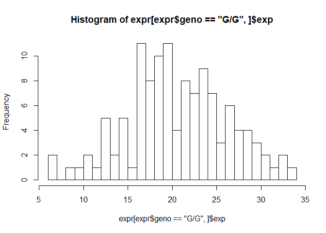
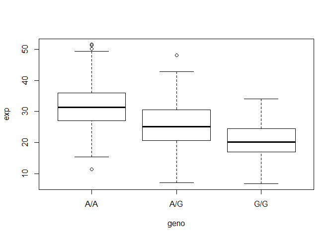

Class14
================

## GitHub Documents

This is an R Markdown format used for publishing markdown documents to
GitHub. When you click the **Knit** button all R code chunks are run and
a markdown file (.md) suitable for publishing to GitHub is generated.

``` r
mxl <- read.csv("373531-SampleGenotypes-Homo_sapiens_Variation_Sample_rs8067378.csv")

head(mxl)
```

    ##   Sample..Male.Female.Unknown. Genotype..forward.strand. Population.s. Father
    ## 1                  NA19648 (F)                       A|A ALL, AMR, MXL      -
    ## 2                  NA19649 (M)                       G|G ALL, AMR, MXL      -
    ## 3                  NA19651 (F)                       A|A ALL, AMR, MXL      -
    ## 4                  NA19652 (M)                       G|G ALL, AMR, MXL      -
    ## 5                  NA19654 (F)                       G|G ALL, AMR, MXL      -
    ## 6                  NA19655 (M)                       A|G ALL, AMR, MXL      -
    ##   Mother
    ## 1      -
    ## 2      -
    ## 3      -
    ## 4      -
    ## 5      -
    ## 6      -

\#\#we want to look at the 2nd column that contains the genotype
information

``` r
mxl$Genotype..forward.strand.
```

    ##  [1] A|A G|G A|A G|G G|G A|G A|G A|A A|G A|A G|A A|A A|A G|G A|A A|G A|G A|G A|G
    ## [20] G|A A|G G|G G|G G|A G|G A|G A|A A|A A|G A|A A|G G|A G|G A|A A|A A|A G|A A|G
    ## [39] A|G A|G A|A G|A A|G G|A G|A A|A A|A A|G A|A A|A A|G A|G A|A G|A A|A G|A A|G
    ## [58] A|A G|A A|G G|G A|A G|A A|G
    ## Levels: A|A A|G G|A G|G

``` r
table(mxl$Genotype..forward.strand.)
```

    ## 
    ## A|A A|G G|A G|G 
    ##  22  21  12   9

\#\#RNA-seq result analysis for different genotypes of this SNP

``` r
expr <- read.table("rs8067378_ENSG00000172057.6.txt")

head(expr)
```

    ##    sample geno      exp
    ## 1 HG00367  A/G 28.96038
    ## 2 NA20768  A/G 20.24449
    ## 3 HG00361  A/A 31.32628
    ## 4 HG00135  A/A 34.11169
    ## 5 NA18870  G/G 18.25141
    ## 6 NA11993  A/A 32.89721

``` r
expr$geno == "G/G"
```

    ##   [1] FALSE FALSE FALSE FALSE  TRUE FALSE FALSE FALSE  TRUE FALSE FALSE FALSE
    ##  [13] FALSE FALSE FALSE FALSE  TRUE FALSE FALSE  TRUE FALSE FALSE  TRUE FALSE
    ##  [25] FALSE FALSE FALSE  TRUE  TRUE FALSE  TRUE  TRUE FALSE FALSE  TRUE FALSE
    ##  [37] FALSE FALSE FALSE FALSE  TRUE FALSE FALSE FALSE FALSE  TRUE  TRUE FALSE
    ##  [49]  TRUE  TRUE FALSE FALSE FALSE FALSE FALSE  TRUE  TRUE FALSE FALSE FALSE
    ##  [61]  TRUE FALSE FALSE FALSE FALSE FALSE FALSE FALSE FALSE FALSE FALSE  TRUE
    ##  [73]  TRUE FALSE FALSE FALSE  TRUE FALSE  TRUE FALSE FALSE FALSE FALSE FALSE
    ##  [85]  TRUE FALSE FALSE FALSE  TRUE FALSE FALSE  TRUE  TRUE FALSE FALSE FALSE
    ##  [97] FALSE FALSE FALSE FALSE FALSE FALSE FALSE  TRUE  TRUE  TRUE FALSE FALSE
    ## [109]  TRUE  TRUE  TRUE FALSE FALSE  TRUE  TRUE FALSE  TRUE  TRUE  TRUE FALSE
    ## [121] FALSE FALSE FALSE FALSE FALSE FALSE FALSE  TRUE FALSE FALSE FALSE  TRUE
    ## [133] FALSE FALSE  TRUE FALSE FALSE FALSE FALSE  TRUE FALSE FALSE  TRUE FALSE
    ## [145] FALSE FALSE FALSE FALSE FALSE  TRUE FALSE FALSE  TRUE FALSE FALSE  TRUE
    ## [157] FALSE FALSE  TRUE FALSE FALSE FALSE  TRUE FALSE FALSE  TRUE FALSE FALSE
    ## [169] FALSE  TRUE  TRUE  TRUE FALSE FALSE  TRUE FALSE FALSE  TRUE FALSE FALSE
    ## [181] FALSE FALSE FALSE FALSE FALSE FALSE FALSE FALSE FALSE  TRUE FALSE FALSE
    ## [193]  TRUE  TRUE  TRUE FALSE FALSE FALSE  TRUE FALSE  TRUE FALSE FALSE FALSE
    ## [205] FALSE FALSE  TRUE FALSE FALSE FALSE  TRUE FALSE FALSE FALSE FALSE FALSE
    ## [217] FALSE  TRUE FALSE FALSE FALSE FALSE FALSE  TRUE  TRUE FALSE FALSE FALSE
    ## [229] FALSE FALSE FALSE  TRUE  TRUE FALSE FALSE FALSE FALSE FALSE  TRUE FALSE
    ## [241]  TRUE FALSE FALSE FALSE FALSE FALSE  TRUE FALSE FALSE  TRUE FALSE FALSE
    ## [253]  TRUE  TRUE FALSE FALSE FALSE FALSE  TRUE FALSE  TRUE FALSE FALSE FALSE
    ## [265] FALSE FALSE  TRUE  TRUE FALSE FALSE  TRUE  TRUE FALSE FALSE FALSE FALSE
    ## [277] FALSE FALSE FALSE  TRUE FALSE FALSE  TRUE FALSE  TRUE FALSE  TRUE  TRUE
    ## [289] FALSE FALSE FALSE  TRUE  TRUE FALSE FALSE FALSE FALSE FALSE  TRUE FALSE
    ## [301] FALSE FALSE FALSE FALSE FALSE FALSE  TRUE  TRUE FALSE FALSE FALSE FALSE
    ## [313] FALSE  TRUE FALSE  TRUE FALSE FALSE  TRUE FALSE FALSE FALSE FALSE FALSE
    ## [325] FALSE FALSE FALSE FALSE FALSE  TRUE FALSE FALSE FALSE FALSE FALSE FALSE
    ## [337] FALSE FALSE FALSE  TRUE FALSE FALSE FALSE  TRUE FALSE FALSE FALSE FALSE
    ## [349] FALSE FALSE  TRUE FALSE FALSE FALSE  TRUE  TRUE  TRUE FALSE FALSE FALSE
    ## [361]  TRUE  TRUE FALSE  TRUE FALSE FALSE FALSE FALSE  TRUE FALSE FALSE FALSE
    ## [373]  TRUE FALSE  TRUE  TRUE FALSE  TRUE  TRUE  TRUE  TRUE FALSE  TRUE FALSE
    ## [385]  TRUE FALSE FALSE FALSE FALSE FALSE  TRUE FALSE  TRUE FALSE FALSE FALSE
    ## [397] FALSE FALSE FALSE FALSE FALSE FALSE FALSE FALSE FALSE FALSE FALSE FALSE
    ## [409] FALSE FALSE FALSE FALSE FALSE FALSE FALSE FALSE FALSE FALSE FALSE FALSE
    ## [421]  TRUE FALSE FALSE FALSE FALSE FALSE FALSE  TRUE FALSE FALSE FALSE FALSE
    ## [433] FALSE FALSE  TRUE  TRUE FALSE FALSE FALSE FALSE FALSE FALSE FALSE FALSE
    ## [445] FALSE  TRUE FALSE FALSE FALSE FALSE FALSE FALSE FALSE  TRUE FALSE FALSE
    ## [457]  TRUE  TRUE FALSE FALSE FALSE FALSE

``` r
x <- 1:10
x[ x > 5 ]
```

    ## [1]  6  7  8  9 10

``` r
expr$geno[expr$geno == "G/G"]
```

    ##   [1] G/G G/G G/G G/G G/G G/G G/G G/G G/G G/G G/G G/G G/G G/G G/G G/G G/G G/G
    ##  [19] G/G G/G G/G G/G G/G G/G G/G G/G G/G G/G G/G G/G G/G G/G G/G G/G G/G G/G
    ##  [37] G/G G/G G/G G/G G/G G/G G/G G/G G/G G/G G/G G/G G/G G/G G/G G/G G/G G/G
    ##  [55] G/G G/G G/G G/G G/G G/G G/G G/G G/G G/G G/G G/G G/G G/G G/G G/G G/G G/G
    ##  [73] G/G G/G G/G G/G G/G G/G G/G G/G G/G G/G G/G G/G G/G G/G G/G G/G G/G G/G
    ##  [91] G/G G/G G/G G/G G/G G/G G/G G/G G/G G/G G/G G/G G/G G/G G/G G/G G/G G/G
    ## [109] G/G G/G G/G G/G G/G G/G G/G G/G G/G G/G G/G G/G G/G
    ## Levels: A/A A/G G/G

``` r
expr[expr$geno == "G/G", ]
```

    ##      sample geno      exp
    ## 5   NA18870  G/G 18.25141
    ## 9   HG00327  G/G 17.67473
    ## 17  NA12546  G/G 18.55622
    ## 20  NA18488  G/G 23.10383
    ## 23  NA19214  G/G 30.94554
    ## 28  HG00112  G/G 21.14387
    ## 29  NA20518  G/G 18.39547
    ## 31  NA19119  G/G 12.02809
    ## 32  HG00247  G/G 17.44761
    ## 35  NA20758  G/G 29.82254
    ## 41  NA12249  G/G 23.01983
    ## 46  HG00320  G/G 13.42470
    ## 47  NA11843  G/G 22.65437
    ## 49  NA20588  G/G 11.07445
    ## 50  NA20510  G/G 28.35841
    ## 56  HG00118  G/G 28.79371
    ## 57  NA18520  G/G 27.08956
    ## 61  NA12234  G/G 16.11138
    ## 72  NA19152  G/G 26.61928
    ## 73  NA20761  G/G 30.18323
    ## 77  NA18923  G/G 19.40790
    ## 79  HG00238  G/G 19.52301
    ## 85  NA12058  G/G 26.56808
    ## 89  HG00129  G/G 17.34076
    ## 92  HG00183  G/G 10.74263
    ## 93  HG00109  G/G 16.66051
    ## 104 NA18517  G/G 29.01720
    ## 105 NA20801  G/G 20.69333
    ## 106 NA20529  G/G 21.15677
    ## 109 HG00349  G/G 18.58691
    ## 110 HG00234  G/G 19.04962
    ## 111 NA19248  G/G 22.81974
    ## 114 NA12813  G/G 32.01142
    ## 115 NA20537  G/G 21.12823
    ## 117 HG00332  G/G 18.61268
    ## 118 HG00152  G/G 19.37093
    ## 119 NA20783  G/G 31.42162
    ## 128 HG00185  G/G 16.67764
    ## 132 NA20531  G/G 19.08659
    ## 135 HG00277  G/G 21.55001
    ## 140 HG00336  G/G  8.29591
    ## 143 NA20581  G/G 12.58869
    ## 150 NA20538  G/G 17.34109
    ## 153 NA20814  G/G 28.23642
    ## 156 NA19171  G/G 19.99979
    ## 159 HG00141  G/G 25.55413
    ## 163 NA19190  G/G 24.45672
    ## 166 NA10851  G/G 23.53572
    ## 170 HG00116  G/G 22.48273
    ## 171 NA12272  G/G 14.66862
    ## 172 NA19096  G/G 33.95602
    ## 175 NA19236  G/G 18.26466
    ## 178 HG00345  G/G 16.06661
    ## 190 HG00156  G/G 17.32504
    ## 193 HG00282  G/G 19.14766
    ## 194 HG00343  G/G 12.57599
    ## 195 HG00139  G/G 22.28749
    ## 199 HG00232  G/G 17.29261
    ## 201 HG00122  G/G 24.18141
    ## 207 NA19149  G/G 16.07627
    ## 211 HG00189  G/G 14.80495
    ## 218 HG00126  G/G 23.46573
    ## 224 HG00265  G/G 28.97074
    ## 225 HG00378  G/G 27.78837
    ## 232 NA20796  G/G 23.92355
    ## 233 NA12399  G/G  9.55902
    ## 239 HG00099  G/G 12.35836
    ## 241 NA19114  G/G 22.53910
    ## 247 NA19210  G/G 21.98118
    ## 250 HG00276  G/G 16.40569
    ## 253 HG00181  G/G 25.21931
    ## 254 HG00346  G/G 24.32857
    ## 259 HG00142  G/G 19.42882
    ## 261 HG00315  G/G 26.56993
    ## 267 HG00250  G/G 13.34557
    ## 268 NA20769  G/G 16.60507
    ## 271 NA19144  G/G 24.85165
    ## 272 NA12815  G/G 21.56943
    ## 280 NA19175  G/G 23.95528
    ## 283 NA18519  G/G 16.18962
    ## 285 NA20535  G/G 22.53720
    ## 287 HG00260  G/G 26.04123
    ## 288 HG00372  G/G  6.67482
    ## 292 HG00261  G/G 20.07363
    ## 293 HG00273  G/G 19.76527
    ## 299 HG00358  G/G 18.50772
    ## 307 NA19121  G/G 20.14146
    ## 308 NA20515  G/G 18.07151
    ## 314 NA10847  G/G  6.94390
    ## 316 NA12400  G/G 22.14277
    ## 319 HG00342  G/G 14.23742
    ## 330 HG00136  G/G 19.85388
    ## 340 NA20765  G/G 27.73467
    ## 344 NA18502  G/G 19.02064
    ## 351 NA20772  G/G 14.49816
    ## 355 HG00257  G/G 26.78940
    ## 356 NA18486  G/G 20.84709
    ## 357 HG00188  G/G 10.77316
    ## 361 HG00280  G/G 12.82128
    ## 362 HG00308  G/G 16.90256
    ## 364 NA18910  G/G 29.60045
    ## 369 HG00281  G/G 14.81945
    ## 373 NA12275  G/G 17.46326
    ## 375 HG00351  G/G 23.26922
    ## 376 HG00186  G/G 21.39806
    ## 378 HG00275  G/G 18.06320
    ## 379 HG00325  G/G 15.91528
    ## 380 NA19118  G/G 24.80823
    ## 381 HG00124  G/G 26.04514
    ## 383 HG02215  G/G 18.28089
    ## 385 HG00134  G/G 23.24907
    ## 391 NA11931  G/G 17.91118
    ## 393 HG00120  G/G 21.09502
    ## 421 NA20582  G/G 24.74366
    ## 428 NA12889  G/G 27.40521
    ## 435 NA12006  G/G 24.85772
    ## 436 NA19108  G/G 23.08482
    ## 446 NA07346  G/G 16.56929
    ## 454 HG00154  G/G 16.69044
    ## 457 HG00233  G/G 25.08880
    ## 458 HG00131  G/G 32.78519

``` r
summary(expr[expr$geno == "G/G", ]$exp)
```

    ##    Min. 1st Qu.  Median    Mean 3rd Qu.    Max. 
    ##   6.675  16.903  20.074  20.594  24.457  33.956

``` r
summary(expr[expr$geno == "A/G", ]$exp)
```

    ##    Min. 1st Qu.  Median    Mean 3rd Qu.    Max. 
    ##   7.075  20.626  25.065  25.397  30.552  48.034

``` r
summary(expr[expr$geno == "A/A", ]$exp)
```

    ##    Min. 1st Qu.  Median    Mean 3rd Qu.    Max. 
    ##   11.40   27.02   31.25   31.82   35.92   51.52

``` r
hist(expr[expr$geno == "G/G", ]$exp, breaks =20)
```

<!-- -->

\#\#use the boxplot function. the input data will be `expr()`. how do we
draw a useful plot … boxplot

``` r
?boxplot()
```

    ## starting httpd help server ... done

``` r
boxplot( exp ~ geno, data=expr)
```

<!-- -->

\#\#add notch

``` r
boxplot( exp ~ geno, data=expr, notch=TRUE)
```

<!-- -->

\#how many samples are we looking for?

``` r
nrow(expr)
```

    ## [1] 462
