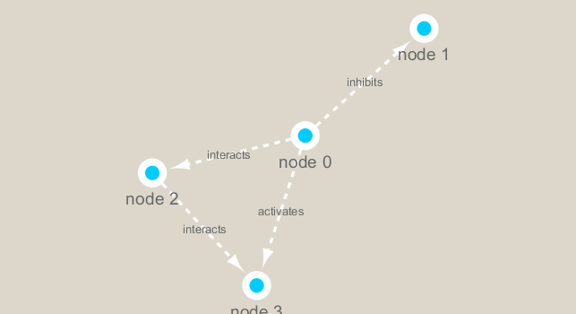
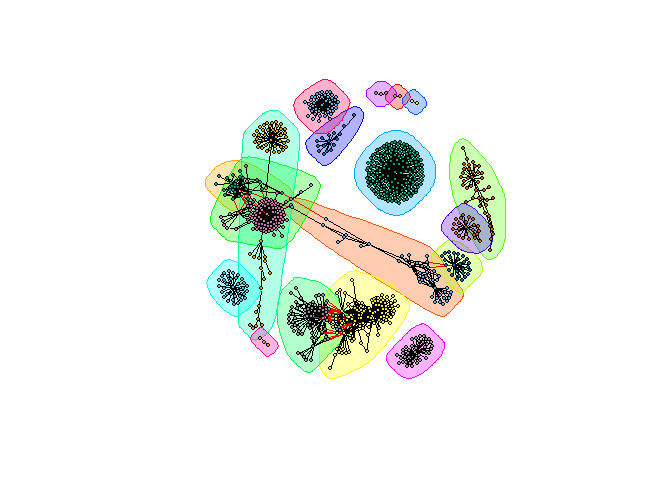

Biological Network Analysis
================

\#\#add the following to your console \# if
(\!requireNamespace(“BiocManager”, quietly = TRUE)) \#
install.packages(“BiocManager”)

\#Install these packages \#BiocManager::install(“RCy3”)

\#install.packages(“igraph”)

\#install.packages(“RColorBrewer”)

``` r
library(RCy3)
library(igraph)
```

    ## Warning: package 'igraph' was built under R version 3.6.3

    ## 
    ## Attaching package: 'igraph'

    ## The following objects are masked from 'package:stats':
    ## 
    ##     decompose, spectrum

    ## The following object is masked from 'package:base':
    ## 
    ##     union

``` r
library(RColorBrewer)
```

\#\#Connect to Cytospace and test whether you are connected

``` r
cytoscapePing()
```

    ## [1] "You are connected to Cytoscape!"

\#\#what version do you have?

``` r
cytoscapeVersionInfo()
```

    ##       apiVersion cytoscapeVersion 
    ##             "v1"          "3.7.2"

\#send your sample network to cytospace

``` r
g <- makeSimpleIgraph()
createNetworkFromIgraph(g,"myGraph")
```

    ## Loading data...
    ## Applying default style...
    ## Applying preferred layout...

    ## networkSUID 
    ##       22637

``` r
setVisualStyle("Marquee")
```

    ##                 message 
    ## "Visual Style applied."

\#\#save the image from cytospace in this document

``` r
fig <- exportImage(filename="demo_marquee", type="png", height=350)
```

    ## Warning: This file already exists. A Cytoscape popup 
    ##                 will be generated to confirm overwrite.

``` r

```


``` r
plot(g)
```

<!-- -->

\#\#get a new file to read and rename. Then, view the first 6 rows

``` r
prok_vir_cor <- read.delim("virus_prok_cor_abundant.tsv", stringsAsFactors = FALSE)

## Have a peak at the first 6 rows
head(prok_vir_cor)
```

    ##       Var1          Var2    weight
    ## 1  ph_1061 AACY020068177 0.8555342
    ## 2  ph_1258 AACY020207233 0.8055750
    ## 3  ph_3164 AACY020207233 0.8122517
    ## 4  ph_1033 AACY020255495 0.8487498
    ## 5 ph_10996 AACY020255495 0.8734617
    ## 6 ph_11038 AACY020255495 0.8740782

``` r
g2 <- graph.data.frame(prok_vir_cor, directed = FALSE)
```

``` r
class(g2)
```

    ## [1] "igraph"

``` r
plot(g2)
```

<!-- -->

\#\#clean up this mess to see the different communities

``` r
plot(g2, vertex.size=3, vertex.label=NA)
```

<!-- -->

``` r
createNetworkFromIgraph(g2,"myIgraph")
```

    ## Loading data...
    ## Applying default style...
    ## Applying preferred layout...

    ## networkSUID 
    ##       22665

\#\#For network community detection

``` r
cb <- cluster_edge_betweenness(g2)
```

    ## Warning in cluster_edge_betweenness(g2): At community.c:460 :Membership vector
    ## will be selected based on the lowest modularity score.

    ## Warning in cluster_edge_betweenness(g2): At community.c:467 :Modularity
    ## calculation with weighted edge betweenness community detection might not make
    ## sense -- modularity treats edge weights as similarities while edge betwenness
    ## treats them as distances

``` r
cb
```

    ## IGRAPH clustering edge betweenness, groups: 18, mod: 0.82
    ## + groups:
    ##   $`1`
    ##   [1] "ph_1061"       "AACY020068177"
    ##   
    ##   $`2`
    ##    [1] "ph_1258"       "ph_5861"       "ph_7172"       "ph_11569"     
    ##    [5] "ph_1291"       "ph_1600"       "ph_2702"       "ph_5790"      
    ##    [9] "ph_5858"       "ph_7594"       "ph_7816"       "ph_784"       
    ##   [13] "ph_1359"       "ph_1534"       "ph_1874"       "ph_2465"      
    ##   [17] "ph_5453"       "ph_900"        "ph_908"        "ph_811"       
    ##   [21] "ph_1367"       "ph_1452"       "ph_1458"       "ph_1723"      
    ##   + ... omitted several groups/vertices

\#\#plot

``` r
plot(cb, y=g2, vertex.label=NA,  vertex.size=3)
```

<!-- -->

\#\#Centrality analysis. How importnat is a node or edge? This will help
you find which nodes are the most important and why they are the most
important.

``` r
pr <- page_rank(g2)
head(pr$vector)
```

    ##      ph_1061      ph_1258      ph_3164      ph_1033     ph_10996     ph_11038 
    ## 0.0011834320 0.0011599483 0.0019042088 0.0005788564 0.0005769663 0.0005745460

\#make a size vector that is between 2 and 20

``` r
v.size <- BBmisc::normalize(pr$vector, range=c(2,20), method="range")
plot(g2, vertex.size=v.size, vertex.label=NA)
```

<!-- -->
